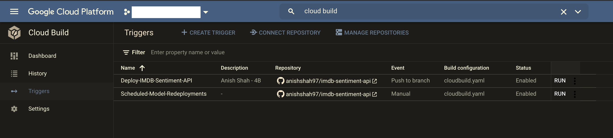
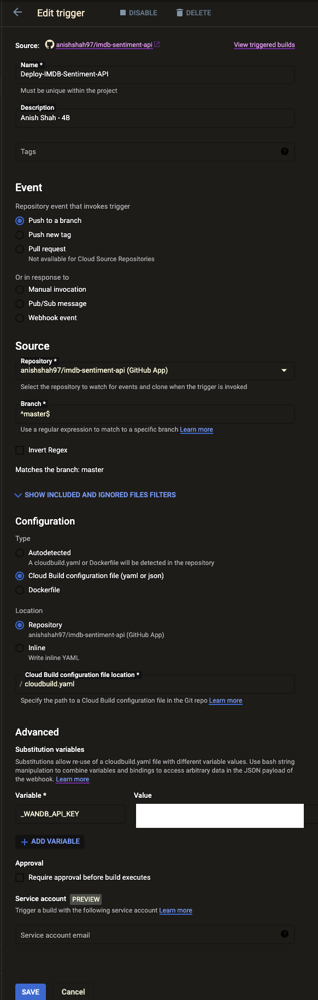
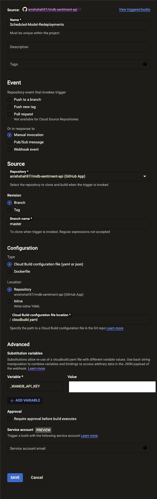
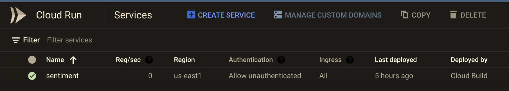
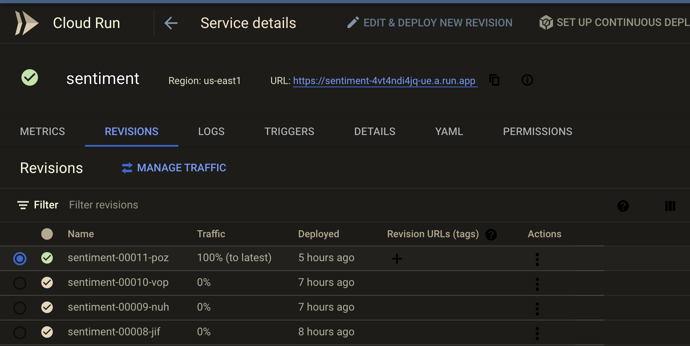
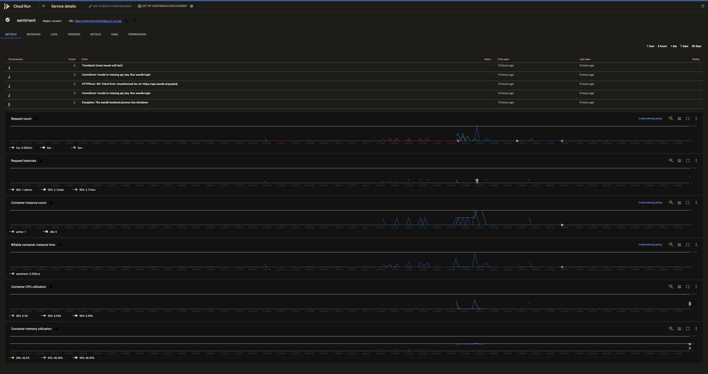
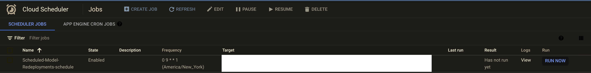
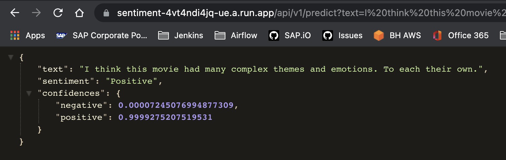
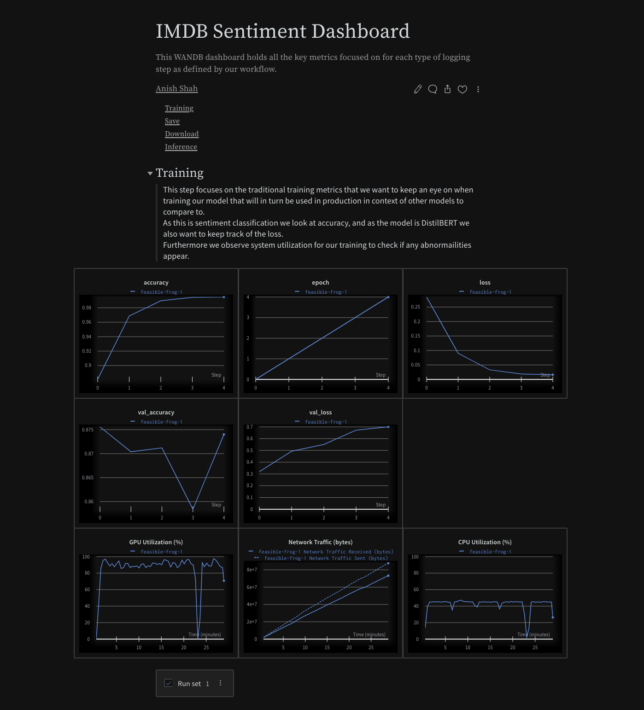
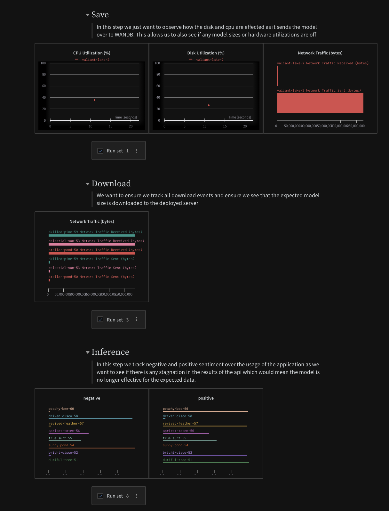

# IMDB Sentiment API

> Midterm submission for Anish Shah 4B Midterm assignment.

In this assignment we will be showing an end to end CI/CD flow for the deployment of binary (negative/positive) sentiment models trained on the [IMDB dataset](https://ai.stanford.edu/~amaas/data/sentiment).

# [Working Model in Production](https://sentiment-4vt4ndi4jq-ue.a.run.app/api/v1/predict?text=Hello%20World)

> `Note`: As this is build using Cloud Run, the initial query may be slow as it needs to setup the server again due to its ephemeral nature

# [Live WANDB Dashboard](https://wandb.ai/ash0ts/imdb-sentiment-api/reports/IMDB-Sentiment-Dashboard--Vmlldzo5MzIwNjQ)

## Table of Contents

[Description](https://github.com/anishshah97/imdb-sentiment-api#description)

- [Assignment](https://github.com/anishshah97/imdb-sentiment-api#assignment)
- [Model Architecture](https://github.com/anishshah97/imdb-sentiment-api#model-architecture)
  - [Task](https://github.com/anishshah97/imdb-sentiment-api#task)
  - [BERT](https://github.com/anishshah97/imdb-sentiment-api#bert)
  - [IMDB](https://github.com/anishshah97/imdb-sentiment-api#imdb)
  - [Training](https://github.com/anishshah97/imdb-sentiment-api#training)
- [Deployment Architecture](https://github.com/anishshah97/imdb-sentiment-api#development-architecture)
- [CI/CD](https://github.com/anishshah97/imdb-sentiment-api#cicd)
- [Screenshots](https://github.com/anishshah97/imdb-sentiment-api#screenshots)
  - [Cloud Build](https://github.com/anishshah97/imdb-sentiment-api#cloud-build)
  - [Cloud Run](https://github.com/anishshah97/imdb-sentiment-api#cloud-run)
  - [Cloud Scheduler](https://github.com/anishshah97/imdb-sentiment-api#cloud-scheduler)
  - [Public API Result](https://github.com/anishshah97/imdb-sentiment-api#public-api-result)
  - [WANDB Dashboard](https://github.com/anishshah97/imdb-sentiment-api#wandb-dashboard)
- [Development Requirements](https://github.com/anishshah97/imdb-sentiment-api#development-requirements)

## Description

### Assignment

> `Task 1 (25 points)`: Create a ML model that sentence sentiment classification for the data set mentioned above. For the NLP text you may consider binary classification ONLY (positive or negative sentiment). You can apply transfer learning to reuse existing model weights. Provide clear documentation of the number of classes, samples and data distributions (Exploratory data analysis) with this task.

> `Task 2 (25 points)`: Setup online ML monitoring for the Deployed model (WANDB). Report the metrics that you will monitor for your task.

> `Task 3 (35 points)`: Package and Dockerize the ML model using FastAPI. You may design any front end or may not use a front end at all as you see fit and deploy to GCP.

> `Task 4 (15 points)`: Create a Continuous deployment pipeline for the application so that updated models can be readily deployed.

### Model Architecture

#### Task

For this task we are to perform sentiment analysis on raw IMDB comments that have already been labeled with a positive/negative sentiment rating. Below is an image that shows how one may approach the problem of sentiment analysis via two different lenses of machine learning engineering.


In our approach we utilize the DistilBERT Transformer architecture to perform the task.

> Use your imagination and replace the word `Spam` with `Positive`

#### BERT

BERT is method of pre-training language representations, meaning that we train a
general-purpose "language understanding" model on a large text corpus (like
Wikipedia), and then use that model for downstream NLP tasks that we care about
(like question answering). BERT outperforms previous methods because it is the
first _Semi-supervised_, _deeply bidirectional_ system for pre-training NLP.

_Semi-supervised_ means that BERT was trained using only a plain text corpus, which
is important because an enormous amount of plain text data is publicly available
on the web in many languages.

Pre-trained representations can also either be _context-free_ or _contextual_,
and contextual representations can further be _unidirectional_ or
_bidirectional_. Context-free models such as
[word2vec](https://www.tensorflow.org/tutorials/representation/word2vec) or
[GloVe](https://nlp.stanford.edu/projects/glove/) generate a single "word
embedding" representation for each word in the vocabulary, so `bank` would have
the same representation in `bank deposit` and `river bank`. Contextual models
instead generate a representation of each word that is based on the other words
in the sentence.

BERT was built upon recent work in pre-training contextual representations —
including [Semi-supervised Sequence Learning](https://arxiv.org/abs/1511.01432),
[Generative Pre-Training](https://blog.openai.com/language-unsupervised/),
[ELMo](https://allennlp.org/elmo), and
[ULMFit](http://nlp.fast.ai/classification/2018/05/15/introducting-ulmfit.html)
— but crucially these models are all _unidirectional_ or _shallowly
bidirectional_. This means that each word is only contextualized using the words
to its left (or right). For example, in the sentence `I made a bank deposit` the
unidirectional representation of `bank` is only based on `I made a` but not
`deposit`. Some previous work does combine the representations from separate
left-context and right-context models, but only in a "shallow" manner. BERT
represents "bank" using both its left and right context — `I made a ... deposit`
— starting from the very bottom of a deep neural network, so it is _deeply
bidirectional_.

BERT uses a simple approach for this: We mask out 15% of the words in the input,
run the entire sequence through a deep bidirectional
[Transformer](https://arxiv.org/abs/1706.03762) encoder, and then predict only
the masked words. For example:

```
Input: the man went to the [MASK1] . he bought a [MASK2] of milk.
Labels: [MASK1] = store; [MASK2] = gallon
```

In order to learn relationships between sentences, we also train on a simple
task which can be generated from any monolingual corpus: Given two sentences `A`
and `B`, is `B` the actual next sentence that comes after `A`, or just a random
sentence from the corpus?

```
Sentence A: the man went to the store .
Sentence B: he bought a gallon of milk .
Label: IsNextSentence
```

```
Sentence A: the man went to the store .
Sentence B: penguins are flightless .
Label: NotNextSentence
```

We then train a large model (12-layer to 24-layer Transformer) on a large corpus
(Wikipedia + [BookCorpus](http://yknzhu.wixsite.com/mbweb)) for a long time (1M
update steps), and that's BERT.


Using BERT has two stages: _Pre-training_ and _fine-tuning_.

**Pre-training** is fairly expensive (four days on 4 to 16 Cloud TPUs), but is a
one-time procedure for each language (current models are English-only, but
multilingual models will be released in the near future). We are releasing a
number of pre-trained models from the paper which were pre-trained at Google.
Most NLP researchers will never need to pre-train their own model from scratch.

**Fine-tuning** is inexpensive. All of the results in the paper can be
replicated in at most 1 hour on a single Cloud TPU, or a few hours on a GPU,
starting from the exact same pre-trained model. SQuAD, for example, can be
trained in around 30 minutes on a single Cloud TPU to achieve a Dev F1 score of
91.0%, which is the single system state-of-the-art.

The other important aspect of BERT is that it can be adapted to many types of
NLP tasks very easily. In the paper, we demonstrate state-of-the-art results on
sentence-level (e.g., SST-2), sentence-pair-level (e.g., MultiNLI), word-level
(e.g., NER), and span-level (e.g., SQuAD) tasks with almost no task-specific
modifications.

`DistilBERT` is a smaller language model, trained from the supervision of BERT in which authors removed the token-type embeddings and the pooler (used for the next sentence classification task) and kept the rest of the architecture identical while reducing the numbers of layers by a factor of two.


#### IMDB

This is a dataset for binary sentiment classification containing substantially more data than previous benchmark datasets. We provide a set of 25,000 highly polar movie reviews for training, and 25,000 for testing. There is additional unlabeled data for use as well. Raw text and already processed bag of words formats are provided.


#### Training

[_**Fine-tuning using HuggingFace Transformers is shown here**_](./notebooks/colab-train-imdb-distilbert-sentiment.ipynb)


### Deployment Architecture

Using [Seldon Core](https://github.com/SeldonIO/seldon-core) and [MlFlow](https://www.mlflow.org/) as reference we made a configurable, extensible, and reusable endpoint architecture for ease of adaptation for a variety of models.

Our emphasis lies on making it easy to load and overwrite the predict functionality of any intended model based on some passed configuration parameters.


> We can see immediately the benefit of having the ability to refer to only one model server image and configuring the deployment run of that image vs. having a seperate image needed for each deployment


> Write a common model class to run your flavor of model if not already supported, pass in some parameters, and reap the benefit of a fully scalable and functional endpoint


> Governance and reproducibility at every level is defined in a very familiar and readable format


> Real time metric tracking allows us to easily account for data drift and also ensure the performance of our model and endpoint meet our expected standards.

- In our case instead of `Prometheus` or any of the other extensive logging tools offered in Seldon, we use `WANDB` to log predictions under the `inferences` job type in the project


> In the extended ecosystem Seldon Core situates itself at the deployment stages of the machine learing lifecycle

Our model deployment is an extremely simplified form of this methodology with a strong focus on integrating well within a reproducible CI/CD flow with inherent connection with [Weights & Biases](https://wandb.ai/).

As such, in its current state this repo is best forked and used as a templating tool to build out a working E2E flow utilizing CI/CD with `GCP` and model registry capabilties via `wandb`.

### CI/CD

Below we capture the CI/CD scenarios that we would expect with our model endpoints.

- In the `automated` build scenario, we capture any changes in the source code for the model server, build the new resultant docker image, push the image to the container registry, and then deploy via cloud run. This captures the CI component.


> Automated builds based on changes in the `master` branch

- In the `scheduled` build scenario, to ensure that we pull the latest model from `wandb` we force the fastapi application to rebuild, which in turn queries the service for the latest recorded model. This ensures we are always serving the most up-to-date model at the endpoint.


> Scheduled builds on `master` to update the endpoint with the latest model

These scenarios together complete the CI/CD flow by allowing us to define a very easy to reproduce structure for defining build triggers based on different branches.

For brevity's sake I did not include the abstraction in this [`cloudbuild.yaml`](./cloudbuild.yaml) however you would simply pass in a substitution variable for the `$MODEL_VERSION` and pass that into the cloud console for that build for that branch. You could also abstract it by the name of the branch.

### Screenshots

#### Cloud Build





> This relies on Cloud Scheduler to schedule the manual trigger run

#### Cloud Run





#### Cloud Scheduler



#### Public API Result



#### WANDB Dashboard




## Development Requirements

- Python3.9.2
- Pip
- Poetry (Python Package Manager)

### M.L Model Environment

```sh
LOCAL_MODEL_DIR = config("LOCAL_MODEL_DIR", default="./ml/model/")
LOCAL_MODEL_NAME = config("LOCAL_MODEL_NAME", default="model.pkl")
MODEL_VERSION = config("MODEL_VERSION", default="latest")
MODEL_LOADER = config("MODEL_LOADER", default="joblib")
WANDB_API_KEY=<API_KEY>
```

### M.L. Model Flavors

[Currently we only have added](app/core/model_loaders.py)

```sh
joblib.load
tf.keras.models.load_model
TFDistilBertForSequenceClassification.from_pretrained
```

### Update `core.events` in `main.py`

In `main.py` we reference a `startup` handler which we imported from `core.events` [(shown here)](app/core/events.py).
This runs on startup of the application.

On startup we use [Weights & Biases](https://wandb.ai/) to pull `LOCAL_MODEL_NAME` from their service and then use `MODEL_LOADER` to load the model before serving the application endpoints.

### Update `/predict`

To update your machine learning model, add your `load` and `method` [change here](app/api/routes/predictor.py) at `predictor.py`.

We adapted the predictor model loader based on `joblib` overwrote the predict function to better suit our `TFDistilBertForSequenceClassification` model.

### Installation

```sh
python -m venv venv
source venv/bin/activate
make install
```

### Runnning Localhost

`make run`

### Deploy app

`make deploy`

### Running Tests

`make test`

### Running Easter Egg

`make easter`

### Access Swagger Documentation

> <http://0.0.0.0:8080/docs>

### Access Redocs Documentation

> <http://0.0.0.0:8080/redoc>

### Project structure

Files related to application are in the `app` or `tests` directories.
Application parts are:

    app
    ├── api              - web related stuff.
    │   └── routes       - web routes.
    ├── core             - application configuration, startup events, logging.
    ├── models           - pydantic models for this application.
    ├── services         - logic that is not just crud related.
    └── main.py          - FastAPI application creation and configuration.
    │
    tests                  - pytest
